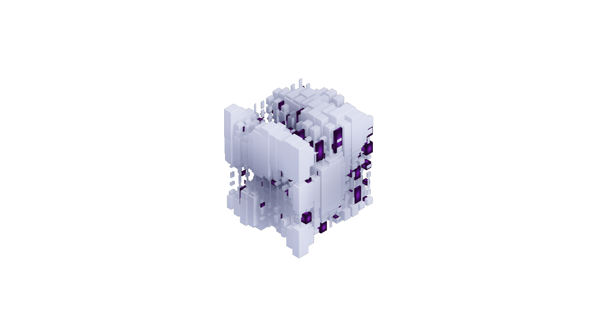

# The Maze Runner

## Business Logic Specification

This program explores a maze, finding a path from an entry point to an exit one.

- The maze is stored in a text file in the backend, with `#` representing walls and `␣` (_empty space_) representing passages. 
- The Maze is surrounded by walls on its four borders, except for its entry/exit points.
    - Entry and exit points are always located on the East and West border.
    - The maze is not directed. As such, exit and entry can be interchanged.
- At the beginning of the exploration, we're located on the entry tile, facing the opposite side (e.g., if entering by the eastern entry, you're facing West).
- The program generates a sequence of instructions to reach the opposite exit (i.e., a "path"):
    - `F` means 'move forward' according to your current direction
    - `R` means 'turn right' (does not move, just changes direction), and `L` means ‘turn left’. 
- A canonical path contains only `F`, `R` and `L` symbols
- A factorized path squashes together similar instructions (i.e., `FFF` = `3F`, `LL` = `2L`).
- Spaces are ignored in the instruction sequence (only for readability: `FFLFF` = `FF L FF`)
- The program takes as input a maze and prints the path on the standard output.
- The program can take a path as input and verify if it's a legit one
- Frontend allows you to choose all necessary parameters (Algorithm, Mode, Maze) and displays the traversal & path 

